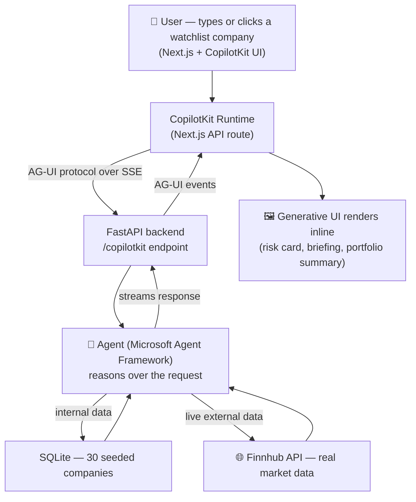

# 🧭 Management & Risk Evaluation Agent

**An agentic decision-support assistant for enterprise risk and growth advisory.**


Built from scratch to explore what it actually takes to ship an agentic product end to end — not a chatbot wearing a system prompt, but a real pipeline: a reasoning agent with genuine tools, a standardized protocol bridging it to a UI, live external data, and a frontend that renders the agent's decisions as structured interfaces instead of walls of text.

> 🏷️ Inspired by how real enterprise risk-advisory platforms (credit risk, company intelligence, growth strategy) are structured. Independent learning project — not affiliated with or endorsed by any company.

---

## 🔍 What it does

Ask it, in plain language:

> *"What's the risk profile for Acme Corp?"* → a real, structured risk card, not a paragraph to parse.

> *"Prepare a meeting briefing for Apple."* → the agent resolves the ticker, pulls **live market data**, checks for internal risk history, and synthesizes both into one decision-ready briefing — honestly noting when a data source isn't available, instead of pretending it is.

> *"Which companies in my portfolio need attention right now?"* → aggregate reasoning across the entire watchlist, not a single lookup.

Click a company in the sidebar instead of typing — the same tool call fires, the same card renders.

## 🧠 Why this exists

Most "AI chatbot" tutorials stop at *prompt → response*. This project exists to answer a harder question: **what does it take to build something a company would actually ship?**

- 🔧 Real tool-calling — six distinct capabilities the agent chooses between, not a single hardcoded path
- 🔌 A protocol-based bridge between agent and UI, so the frontend never needs to know or care what's actually running the agent underneath
- 🖼️ Generative UI — the agent's output *is* the interface
- 🌐 A real external data source (live market data), cleanly separated from internal proprietary logic
- ⚖️ A deliberate, honest boundary around autonomy — what the agent can decide alone vs. what needs a human
- ✅ An automated test suite that already caught and pinned down a real bug found during development

## 🏗️ Architecture



The frontend never talks to the agent directly — it talks to a *protocol*. Swap the agent framework underneath, and the UI doesn't need to change.

## ⚙️ Capabilities

| Tool | What it does | Data source |
|---|---|---|
| 🔎 `get_company_profile` | Internal risk score, sector, trend, recent signals | SQLite (internal) |
| 📋 `list_all_companies` | Full watchlist enumeration | SQLite (internal) |
| 📄 `generate_formal_report` | Fixed-structure compliance-style report with a recommendation | SQLite (internal) |
| 📈 `get_market_data_tool` | Real, live price, market cap, and exchange, resolved from a company name | Finnhub API (external) |
| 🧩 `prepare_meeting_briefing` | Synthesizes internal risk + live market data into one briefing — degrades gracefully if either source is missing | Both, combined |
| 📊 `get_portfolio_risk_summary` | Aggregate reasoning across the entire watchlist — top concerns vs. emerging risk, deduplicated | SQLite (internal) |

## 🎨 Design system

A deliberate visual identity, not default ShadCN styling: a graph-paper grid background (reinforcing "quantitative analysis tool," not decoration), a navy/ochre/oxblood color system evoking financial print rather than generic SaaS blue, Space Grotesk for display type paired with IBM Plex Sans/Mono for body and data — every numeral in the app renders in monospace, functionally, because precision is the actual subject matter.

## 🧰 Tech stack

| Layer | Technology | Role |
|---|---|---|
| Frontend | Next.js (App Router) + TypeScript | UI, routing, Server/Client Component boundary |
| UI Kit | ShadCN (customized) + Tailwind CSS | Accessible, ownable component primitives |
| Agent bridge | CopilotKit + AG-UI protocol | Standardized agent ↔ UI communication over SSE |
| Backend | FastAPI | Request validation, routing, async I/O |
| Agent runtime | Microsoft Agent Framework | Reasoning loop, tool calling, conversation state |
| LLM | OpenAI (`gpt-4o-mini`) | Language understanding and decision-making |
| Data | SQLite + SQLAlchemy | Persistent internal company risk data |
| External data | Finnhub API | Live market data, free tier |
| Testing | pytest | Service-layer unit tests, including a real regression test |

## 📁 Project structure

```
agentic-app/
├── backend/
│   ├── app/
│   │   ├── main.py                       # FastAPI app + AG-UI endpoint + CORS
│   │   ├── database.py                   # Engine, session factory (absolute-path safe)
│   │   ├── agent/
│   │   │   ├── agent.py                  # Agent definition: instructions + 6 tools
│   │   │   └── tools.py                  # Tool wrappers the LLM can call
│   │   ├── routers/companies.py           # REST endpoints
│   │   ├── models/company.py              # SQLAlchemy model
│   │   └── services/
│   │       ├── company_service.py         # Internal risk data
│   │       ├── market_data_service.py     # Finnhub integration
│   │       ├── briefing_service.py        # Synthesis logic
│   │       └── portfolio_service.py       # Aggregate reasoning
│   ├── tests/                              # pytest suite
│   └── seed_db.py
└── frontend/
    ├── app/
    │   ├── page.tsx                       # Server Component — fetches watchlist
    │   ├── layout.tsx                     # CopilotKitProvider + fonts
    │   └── api/copilotkit/route.ts         # AG-UI bridge to FastAPI
    └── components/
        ├── chat-workspace.tsx              # Main client shell — chat + sidebar
        ├── company-profile-card.tsx
        ├── formal-report-card.tsx
        ├── meeting-briefing-card.tsx
        └── portfolio-summary-card.tsx
```

## 🚀 Getting started

**Prerequisites**: Python 3.10+, Node.js 18+, an OpenAI API key, a free [Finnhub](https://finnhub.io/register) API key.

**Backend**
```bash
cd backend
python -m venv venv
venv\Scripts\activate        # Windows
pip install -r requirements.txt
# .env: OPENAI_API_KEY, OPENAI_CHAT_MODEL, FINNHUB_API_KEY
python seed_db.py
uvicorn app.main:app --reload --port 8000
```

**Frontend**
```bash
cd frontend
npm install
npm run dev
```

Open `http://localhost:3000` — **not** a network IP; the dev server's hot-reload connection requires `localhost`.

## ✅ Testing

```bash
cd backend
pytest
```

The suite covers the service layer directly (no live network calls — external APIs are mocked), including a **regression test for a real bug found during development**: the portfolio summary's "top concerns" and "worsening trend" lists initially overlapped completely; a test now asserts they're always disjoint.

## 🗺️ Roadmap

- [x] Backend skeleton, agent integration, AG-UI bridge
- [x] Next.js + CopilotKit frontend, full pipeline working end to end
- [x] Generative UI across all six tools
- [x] Real persistence (SQLite + SQLAlchemy)
- [x] Live external data integration (Finnhub) with graceful degradation
- [x] Custom, non-default design system
- [x] Automated test suite
- [ ] Hard-enforced (protocol-level) approval gating — currently instruction-based; blocked by a documented event-name mismatch between CopilotKit's `useInterrupt` (`on_interrupt`) and MAF's approval event (`function_approval_request`) at current library versions
- [ ] Persistent, switchable conversation threads (Claude-style history sidebar)
- [ ] Peer/sector comparison tool

## 🧗 A note on the journey

Nothing here worked on the first try, and the code is better for it. A fast-moving framework renamed its own core class mid-build. A `.env` file silently failed to load because a client library doesn't auto-read it without being told to. A relative database path resolved correctly from one folder and silently created an empty database from another — passing tests locally while quietly pointing at nothing. All of it is documented here on purpose: debugging real failure modes *is* the engineering work, and a project that pretends everything worked cleanly the first time is less credible, not more.

## 📄 License

MIT — do whatever you want with it.

---

*Built as a hands-on deep dive into agentic system design — from React fundamentals to a working, tested, multi-source AG-UI pipeline.*