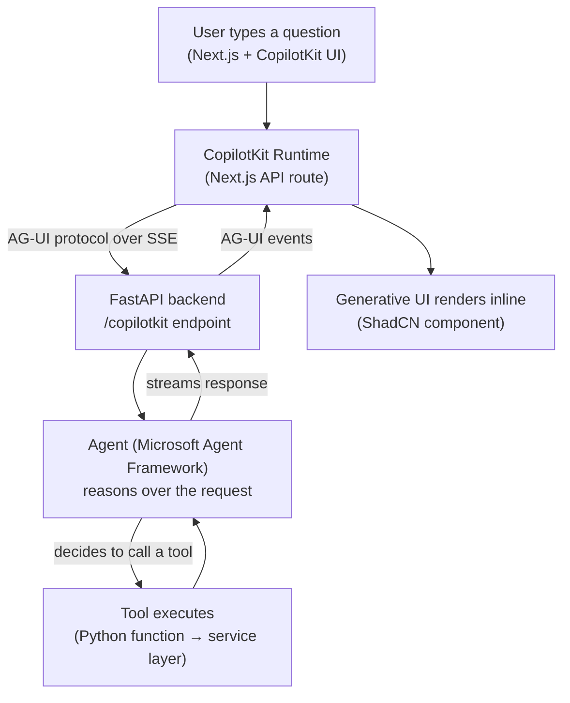

# Management & Risk Evaluation Agent

**An agentic decision-support assistant for enterprise risk and growth advisory.**

Built from scratch to explore what it actually takes to ship an agentic product end to end — not a chatbot with a system prompt, but a full pipeline: a reasoning agent with real tools, a standardized protocol connecting it to a UI, and a frontend that renders the agent's decisions as structured, glanceable interfaces instead of walls of text.

> This project draws inspiration from how enterprise risk-advisory platforms (credit risk, company intelligence, growth strategy) are structured — it is an independent learning project, not affiliated with or endorsed by any company.

---

## What it does

A relationship manager (or analyst, or anyone doing due diligence before a meeting) asks, in plain language:

> *"What's the risk profile for Acme Corp?"*

...and gets back a real, structured answer — sector, risk score, trend, recent signals — rendered as an actual UI card, not a paragraph to parse. Ask a follow-up, and the agent remembers the conversation. Ask about a company that doesn't exist, and it says so cleanly instead of making something up.

## Why this exists

Most "AI chatbot" tutorials stop at *prompt → response*. This project exists to answer a harder, more interesting question: **what does it take to build something a company would actually ship?** That means:

- Real tool-calling, not hallucinated data
- A protocol-based bridge between agent and UI (so the frontend never needs to know or care what's running the agent underneath)
- Generative UI — the agent's output *is* the interface, not a description of one
- A deliberate boundary between what the agent can do autonomously and what needs human confirmation

## Architecture



The frontend never talks to the agent directly — it talks to a *protocol*. Swap the agent framework underneath, and the UI doesn't need to change. That's the point.

## Tech stack

| Layer | Technology | Role |
|---|---|---|
| Frontend | Next.js (App Router) + TypeScript | UI, routing, Server/Client Component boundary |
| UI Kit | ShadCN + Tailwind CSS | Accessible, ownable component primitives |
| Agent bridge | CopilotKit + AG-UI protocol | Standardized agent ↔ UI communication over SSE |
| Backend | FastAPI | Request validation, routing, async I/O |
| Agent runtime | Microsoft Agent Framework | Reasoning loop, tool calling, conversation state |
| LLM | OpenAI (`gpt-4o-mini`) | Language understanding and decision-making |
| Data | SQLite + SQLAlchemy *(in progress)* | Persistent company risk data |

## Project structure

```
agentic-app/
├── backend/
│   ├── app/
│   │   ├── main.py              # FastAPI app + AG-UI endpoint registration
│   │   ├── agent/                # Agent definition + tools
│   │   ├── routers/              # REST endpoints
│   │   ├── services/              # Business logic, isolated from HTTP/agent concerns
│   │   ├── models/                # SQLAlchemy models (Phase 6)
│   │   └── schemas/               # Pydantic request/response models
│   └── requirements.txt
└── frontend/
    ├── app/
    │   ├── layout.tsx             # CopilotKit provider
    │   ├── page.tsx               # Chat UI + generative UI wiring
    │   └── api/copilotkit/        # Runtime route (proxy to FastAPI)
    └── components/                 # ShadCN components + custom cards
```

## Getting started

**Prerequisites**: Python 3.10+, Node.js 18+, an OpenAI API key.

**Backend**
```bash
cd backend
python -m venv venv
venv\Scripts\activate        # Windows
pip install -r requirements.txt
# create .env with OPENAI_API_KEY and OPENAI_CHAT_MODEL
uvicorn app.main:app --reload --port 8000
```

**Frontend**
```bash
cd frontend
npm install
npm run dev
```

Open `http://localhost:3000` — **not** a network IP address, or the dev server's hot-reload connection will fail.

## Roadmap

- [x] **Phase 1** — Backend skeleton with mock data + REST endpoint
- [x] **Phase 2** — Agent integration (Microsoft Agent Framework + tool calling)
- [x] **Phase 3** — AG-UI protocol bridge over FastAPI
- [x] **Phase 4** — Next.js + CopilotKit frontend, full pipeline working end to end
- [x] **Phase 5** — Generative UI: risk profiles render as real components, not text
- [ ] **Phase 6** — Real persistence with SQLite + SQLAlchemy
- [ ] **Phase 7** — Human-in-the-loop confirmation for sensitive actions

## A note on the journey

Nothing here worked on the first try. Class names got mismatched, `.env` files silently failed to load, a fast-moving framework renamed its own core class mid-build, and a WebSocket error turned out to be a red herring from accessing `localhost` via the wrong IP. All of it is left in, conceptually, because debugging *is* the work — and every one of those failures taught something a tutorial that "just works" wouldn't have.

## License

MIT — do whatever you want with it.

---

*Built as a hands-on deep dive into agentic system design — from React fundamentals to a working AG-UI pipeline.*
